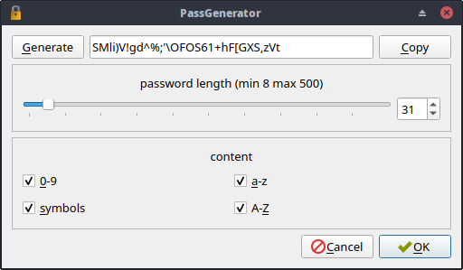
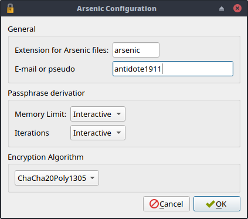

[](https://travis-ci.org/Antidote1911/Arsenic)
[](https://ci.appveyor.com/project/Antidote1911/arsenic)

# Arsenic
**A simple tool to encrypt files or folders with strong algorithms.**


## Simple Description: ##
Arsenic was intended as a lightweight, portable application, that would encode a list of local files and directories using a pass-phrase. The user can select between three strong algorithms:
- [XChaCha20Poly1305](https://botan.randombit.net/handbook/api_ref/cipher_modes.html#chacha20poly1305)
- [AES256](https://en.wikipedia.org/wiki/Advanced_Encryption_Standard)/[GCM](https://en.wikipedia.org/wiki/Galois/Counter_Mode)
- [Serpent](https://en.wikipedia.org/wiki/Serpent_(cipher))/[GCM](https://en.wikipedia.org/wiki/Galois/Counter_Mode)

Some useful tools are included. Hash calculator, password generator etc...

Arsenic was originally forked from [QtCrypt](https://github.com/trashctor/QtCrypt) published in 2015 by [trashctor](https://github.com/trashctor).<br>
https://github.com/trashctor/QtCrypt<br>

- Updated from Qt4 to Qt5
- Switch from an old [libsodium](https://github.com/jedisct1/libsodium "Strong cryptographic library") version to [Botan](https://botan.randombit.net/ "Strong cryptographic library").
- Key derivation is now calculated by [Argon2](https://en.wikipedia.org/wiki/Argon2)
- The user can now select between 3 [AEAD encryption algorithms](https://en.wikipedia.org/wiki/Authenticated_encryption).
([XChaCha20Poly1305](https://botan.randombit.net/handbook/api_ref/cipher_modes.html#chacha20poly1305), [AES256](https://en.wikipedia.org/wiki/Advanced_Encryption_Standard)/[GCM](https://en.wikipedia.org/wiki/Galois/Counter_Mode), or [Serpent](https://en.wikipedia.org/wiki/Serpent_(cipher))/[GCM](https://en.wikipedia.org/wiki/Galois/Counter_Mode))
- Support GUI mode and command-line mode
- add Options and configuration
- Add a Password generator
- Add a Hash calculator :
<em>(SHA-3, SHA-1, SHA-224, SHA-256, SHA-384, SHA-512, SHA-512-256, Skein-512, Keccak-1600, Whirlpool, Blake2b, SHAKE-128, SHAKE-256, GOST-34.11, SM3, Tiger, Streebog-256, Streebog-512, RIPEMD-160, Adler32, MD4, MD5, CRC24, CRC32)</em>

Thanks to :
- [trashctor](https://github.com/trashctor) for the original QtCrypt.
- [Jack Lloyd from randombit.net](https://botan.randombit.net) for the powerful Botan C++ cryptographic library. You can find the Github [here](https://github.com/randombit/botan).<br>
It is released under the permissive Simplified [BSD license](https://botan.randombit.net/license.txt)

## Command line mode: ##
**The command line interface doesn't support space in the arguments.**
Encrypt a file named "test.mkv" with the secret passphrase "mysuperbadpassphrase" and user e-mail "myemail@cool.com". Encryption produce the encrypted file "test.mkv.arsenic" but it can be renamed because the original file name is encrypted in the file.

```bash
    ./arsenic -e -p mysuperbadpassphrase -n myemail@cool.com test.mkv
    # For decrypt this file :
    ./arsenic -d -p mysuperbadpassphrase test.mkv.arsenic
    # View help :
    ./arsenic -h
    # View Arsenic version :
    ./arsenic -v
```

## Technical description: ##
- First, the file or directory is zipped
- A 96 bytes Master key is generated by Argon2 from the user pass-phrase and a 16 bytes (128 bits) random salt
- The master key is split in three 32 bytes keys. Key1, Key2, Key3
- A 128 bits initial random nonce (or initialization vector) is generated
- Write in the encrypted file a "magic number"
- Write in the encrypted file the version of Arsenic
- Write Argon2 parameters (memory limit, iterations, salt)
- Write the name of the selected AEAD algorithm
- Write additional data (user name or e-mail)
- Write the initial nonce
- encrypt (with key1 and nonce) the header size, and write it
- encrypt (with key2 and nonce+) original file name and file size
- encrypt (with key3 and nonce++) the encrypted file.
- Write the 16 bytes authentication tag.

Notes:
The initial nonce is incremented before all encryption operations to ensure it is never reused with the same key.<br>
Additional data is NOT a secret and it is written in clear. It is only used by the authentication algorithm. You can read more informations
on AEAD encryption [on wikipedia](https://en.wikipedia.org/wiki/Authenticated_encryption)
The encryption is optimized for big files. Arsenic read and encrypt chunk by chunk.

## Developers: ##
The application was primarily built around the Qt 5.13.2-1 framework. Other dependencies include QuaZIP 0.8.1, zlib 1.2.11, used for zipping and unzipping directories, and Botan 2.12. Since these libraries do not depend on anything besides Qt, they should theoretically compile on any platform that Qt supports.
To update Botan, you must regenerate the amalgamation build from source:

```bash
    # for linux clang
    ./configure.py --cc=clang --amalgamation --disable-shared --disable-modules=pkcs11
    # for linux gcc
    ./configure.py --cc=gcc --amalgamation --disable-shared --disable-modules=pkcs11
    # for Windows MinGW x86
    python configure.py --cpu=x86_64 --cc=gcc --os=mingw --amalgamation --disable-shared --disable-modules=pkcs11
    # for Windows MinGW x32
    python configure.py --cpu=x86_32 --cc=gcc --os=mingw --amalgamation --disable-shared --disable-modules=pkcs11
```

To build the program from source, the appropriate Qt version should be installed and configured for the target platform, including any tools such as Qt Creator.<br>
Arsenic work well but it need some code simplifications, code comments, orthographic corrections ,etc.<br> Any suggestions or help are welcome.

## CAUTION: ##
A simple tool to encrypt file is not magic. If You use an unsecure system, Arsenic (and all encryption tools) are useless. Arsenic do not protect you from key-logger, disk analyze, virus, vignetting cache etc...

## More Screenshots: ##





## License: ##
This program is free software: you can redistribute it and/or modify
it under the terms of the GNU General Public License as published by
the Free Software Foundation, either version 3 of the License, or
(at your option) any later version.

This program is distributed in the hope that it will be useful,
but WITHOUT ANY WARRANTY; without even the implied warranty of
MERCHANTABILITY or FITNESS FOR A PARTICULAR PURPOSE.  See the
GNU General Public License for more details.

You should have received a copy of the GNU General Public License
along with this program.  If not, see <https://www.gnu.org/licenses/>.


