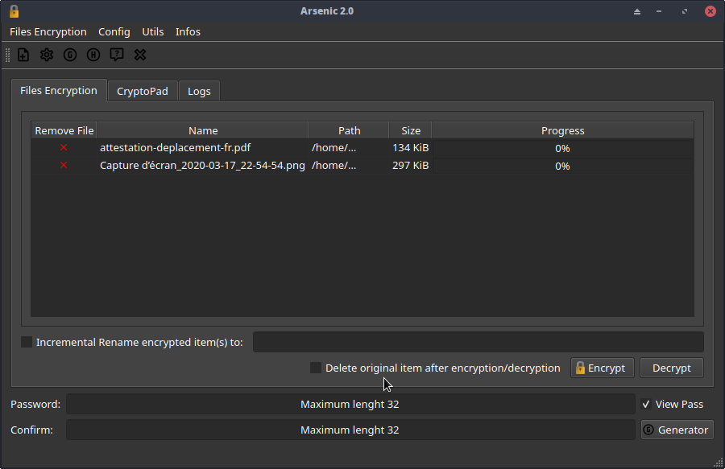
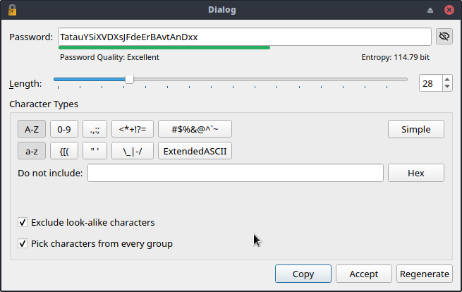
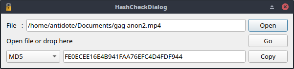
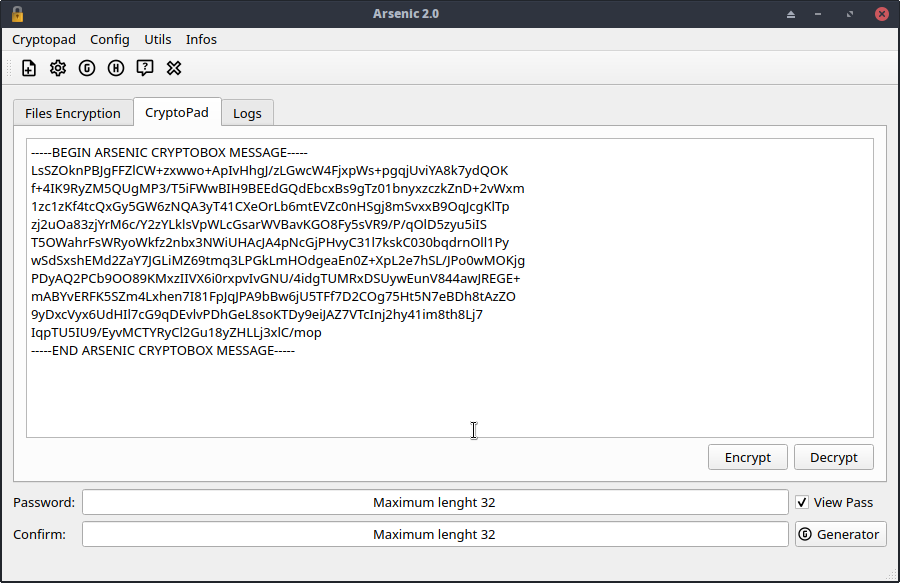

[](https://opensource.org/licenses/GPL-3.0)
[](https://github.com/Antidote1911/arsenic_cmake/actions/workflows/github_workflows_build.yml)


# Arsenic
**A simple tool to encrypt files and text with strong algorithms.**  
Tested with Windows 10 and all major Linux distributions. Arsenic is developed on Archlinux.

Latest Windows x64 release is [here](https://github.com/Antidote1911/arsenic/releases/latest).

**New in version 5:**
- Work with Qt6.
- Now, the user can choose several encryption algorithms and not only the paranoid triple encryption.
- Encryption or decryption are correctly stopped when a file is removed from the job list and the partial output file is deleted.
- Encryption can generate unique output file name if the file exist and not only decryption like previous versions.



*More screenshots at the and of this readme.*


## Simple Description: ##
Arsenic was intended as a lightweight application, that would encode a list of local files using a password. A simple text editor named "CryptoPad" can be used for send encrypted text by email. Some useful tools are included. A file Hash calculator and a password generator.

For file encryption you can choose several algorithms:
- XChaCha20/Poly1305
- AES-256/EAX
- AES-256/GCM
- AES-256/SIV
- Serpent/EAX
- Serpent/GCM
- Serpent/SIV.
- Triple Encryption (XChaCha20/Poly1305, AES256/EAX, Serpent/GCM)

All mode are very strong. You can choose the faster on your machine. The decryption routine automatically detect the right settings. You don't have to retain anything. CryptoPad always use triple encryption.

**Note on triple encryption:**    
It's not proved multiple encryption is most secure. But if you are paranoid, you can use it to encrypt your files !

## Technical description: ##

**Arsenic encrypted file :**

**Password Derivation :**  
A 32 bytes (64 for SIV mode) "Masterkey" is generated by Argon2 from the user password and a 16 bytes random salt. This "Masterkey" is used to encrypt with the selected algorithm.

**initialization vectors (or nonces) :**  
A 24 bytes initialization vector is generated by Botan random number generator. This nonce is used to encrypt with the selected algorithm and the MasterKey. Nonce is always incremented before all steps to ensure to never reuse it with the same key. It is incremented after file Name encryption, and after all encrypted chunk.

First, Arsenic encrypt the original file name and a randomized block of data. After that, the original file is encrypted chunk by chunk.

the output file is :
- Magic number
- Arsenic version
- Argon memlimit
- Argon iterations
- Selected algorithm
- original fileNameSize  (necessary for decrypt the original name)
- original fileSize
- Argon salt  (16 bytes)
- iv (24 bytes)
- encrypted FileName  ( fileNameSize + randomBloc(BUFFER_SIZE) + Authentication tag)
- encrypted chunk_1  ( BUFFER_SIZE + Authentication tag )
- encrypted chunk_2  ( BUFFER_SIZE + Authentication tag )
- ....etc

**Arsenic triple encrypted file :**  

**Password Derivation :**  
A 96 bytes "Masterkey" is generated by Argon2 from the user password and a 16 bytes random salt. This "Masterkey" is split in three 32 bytes keys for the triple encryption.

**initialization vectors (or nonces) :**  
A 72 bytes "MasterNonce" is generated by Botan random number generator. This master nonce is split in three 24 bytes nonces for the triple encryption. This three nonces are always incremented before all steps to ensure to never reuse it with the same key. They are incremented after file Name encryption, and after all encrypted chunk.

the output file is :
- Magic number
- Arsenic version
- Argon memlimit
- Argon iterations
- Selected algorithm (it's "Triple Encryption")
- original fileNameSize  (necessary for decrypt the original name)
- original fileSize
- Argon salt  (16 bytes)
- ivChaCha20 +  ivAES +  ivSerpent (24 bytes * 3)
- encrypted FileName  ( fileNameSize + randomBloc(BUFFER_SIZE) + Authentication tag * 3)
- encrypted chunk_1  ( BUFFER_SIZE + Authentication tag * 3 )
- encrypted chunk_2  ( BUFFER_SIZE + Authentication tag * 3 )
- ....etc

**Text encryption with cryptopad**  

- version    (4 bytes)
- salt       (16 bytes) for Argon2
- ivChaCha20 +  ivAES +  ivSerpent (24 bytes * 3)
- ciphertext
- Authentication tag * 3

**Hash calculator**  
Supported algorithms: SHA-3, SHA-1, SHA-224, SHA-256, SHA-384, SHA-512, SHA-512-256, Skein-512, Keccak-1600, Whirlpool, Blake2b, SHAKE-128, SHAKE-256, GOST-34.11, SM3, Streebog-256, Streebog-512, RIPEMD-160, Adler32, MD4, MD5, CRC24, CRC32


## Developers: ##
The application was primarily built around the Qt 6 framework.
Botan is automatically downloaded by cmake, and an amalgamation build is generated (botan_all.cpp and botan_all.h).

To build the program from source, Qt 6 should be installed and configured.  

On linux distributions you can run this script in the extracted source archive:
```bash
  ./build.sh
```
Arsenic work well but it need some code simplifications, code comments, orthographic corrections ,etc.  
Any suggestions or help are welcome.


- [Jack Lloyd from randombit.net](https://botan.randombit.net) for the powerful Botan C++ cryptographic library. You can find the Github [here](https://github.com/randombit/botan).  
It is released under the permissive Simplified [BSD license](https://botan.randombit.net/license.txt)

- [KeepassXC](https://github.com/keepassxreboot/keepassxc) for the password generator.

## CAUTION: ##
A simple tool to encrypt file is not magic. If You use an insecure system, Arsenic (and all encryption tools) are useless. Arsenic do not protect you from key-logger, disk analyze, virus, operating system cache etc...

## More Screenshots: ##



*The password generator by the KeepassXC project.*




## License: ##
This program is free software: you can redistribute it and/or modify
it under the terms of the GNU General Public License as published by
the Free Software Foundation, either version 3 of the License, or
(at your option) any later version.

This program is distributed in the hope that it will be useful,
but WITHOUT ANY WARRANTY; without even the implied warranty of
MERCHANTABILITY or FITNESS FOR A PARTICULAR PURPOSE.  See the
GNU General Public License for more details.

You should have received a copy of the GNU General Public License
along with this program.  If not, see <https://www.gnu.org/licenses/>.
