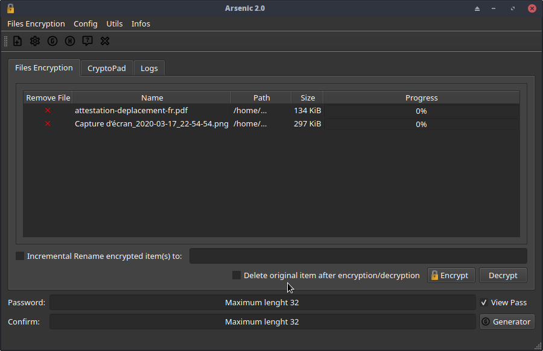

[](https://opensource.org/licenses/GPL-3.0)
[](https://github.com/Antidote1911/arsenic/actions/workflows/build.yml)

# Arsenic

**A tool to encrypt arbitrary files using a strong triple-layer authenticated cipher.**

Tested on Windows 10 and all major Linux distributions. Developed on Arch Linux.

Latest Windows x64 release is [here](https://github.com/Antidote1911/arsenic/releases/latest).



---

## Features

- Encrypt or decrypt any file or folder with a passphrase.
- **CPDF format** — fully interoperable with [CryptoPad](https://github.com/Antidote1911/cryptopad).
- Parallel chunk processing: all CPU cores are used simultaneously.
- Password generator and hash calculator included.
- Three themes: Dark, Light, Classic.

---

## Encryption

Every file is encrypted with a fixed **triple-layer AEAD** scheme. The three ciphers are applied sequentially to each chunk:

| Step | Algorithm | Key | Nonce |
|------|-----------|-----|-------|
| 1 | AES-256/SIV | 512 bits (nonce-misuse-resistant) | 128 bits |
| 2 | Serpent-256/GCM | 256 bits | 96 bits |
| 3 | XChaCha20/Poly1305 | 256 bits | 192 bits |

Each chunk carries **3 independent authentication tags** (one per layer, 16 bytes each = 48 bytes of overhead per chunk). Any modification to the ciphertext is detected during decryption.

### Key derivation

The passphrase is processed via **Argon2id** to produce a 32-byte Key Encryption Key (KEK).
The actual cipher keys (K1, K2, K3, K4) live in a randomly-generated Data Encryption Key (DEK)
that is wrapped with the KEK using XChaCha20Poly1305 and stored in the file header.

| Parameter | Value |
|-----------|-------|
| Memory | 64 MiB (65 536 KiB) |
| Iterations | 3 |
| Parallelism | 4 |
| Salt | 16 bytes (random, stored in file header) |
| Output | **32 bytes** (KEK) |

### File format (.cpdf)

Files are split into **1 MiB chunks** processed in parallel.
See [FORMAT_en.md](FORMAT_en.md) (English) or [FORMAT_fr.md](FORMAT_fr.md) (French) for the complete binary specification.

---

## Hash calculator

Supported algorithms: SHA-3, SHA-1, SHA-224, SHA-256, SHA-384, SHA-512, SHA-512-256,
Skein-512, Keccak-1600, Whirlpool, Blake2b, BLAKE3, SHAKE-128(128), SHAKE-256(256),
GOST-34.11, SM3, Streebog-256, Streebog-512, RIPEMD-160, Adler32, MD4, MD5, CRC24, CRC32.

---

## Building from source

The project requires **Qt 6** and uses **CMake**.
[Botan 3](https://botan.randombit.net) and [BLAKE3](https://github.com/BLAKE3-team/BLAKE3) are downloaded and compiled automatically by CMake.

```bash
cmake -B build
cmake --build build -j$(nproc)
```

---

## Credits

- [Jack Lloyd / randombit.net](https://botan.randombit.net) — [Botan 3](https://github.com/randombit/botan) C++ cryptographic library (BSD 2-Clause license).
- [BLAKE3 team](https://github.com/BLAKE3-team/BLAKE3) — BLAKE3 cryptographic hash function (CC0 / Apache 2.0).
- [KeePassXC project](https://github.com/keepassxreboot/keepassxc) — password generator.

---

## CAUTION

Encryption software cannot protect you from keyloggers, memory analysis, compromised operating
systems, or other threats at the hardware/OS level. Arsenic secures the file contents at rest;
it is not a substitute for a secure overall system.

---

## License

This program is free software: you can redistribute it and/or modify it under the terms of the
GNU General Public License as published by the Free Software Foundation, version 3.

This program is distributed in the hope that it will be useful, but WITHOUT ANY WARRANTY;
without even the implied warranty of MERCHANTABILITY or FITNESS FOR A PARTICULAR PURPOSE.
See the GNU General Public License for more details: <https://www.gnu.org/licenses/>.
